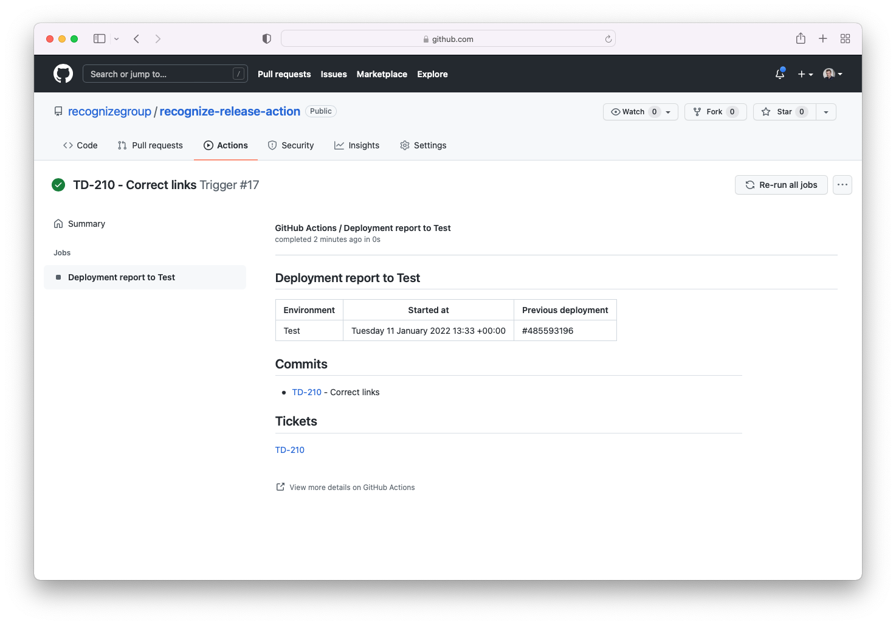

<<<<<<< HEAD
# Recognize Release Action

This action can be used to annotate commits with additional release information. When triggering the action on deployment
to an environment, this action will automatically detect the changes between the current and previous deployment
and will find the tickets that have been mentioned in the commit message. A check will be added to the commit.

## Example
```yaml
on:
  deployment
jobs:
  deployment-report:
    runs-on: ubuntu-latest
    steps:
      - uses: recognizegroup/recognize-release-action@v1
        with:
          token: ${{ github.token }} # Token for the GitHub API
          ticket-url: https://instance.atlassian.net/browse/<ticket> # Optional ticket URL, used to convert tickets to links
```

## Screenshot

=======
